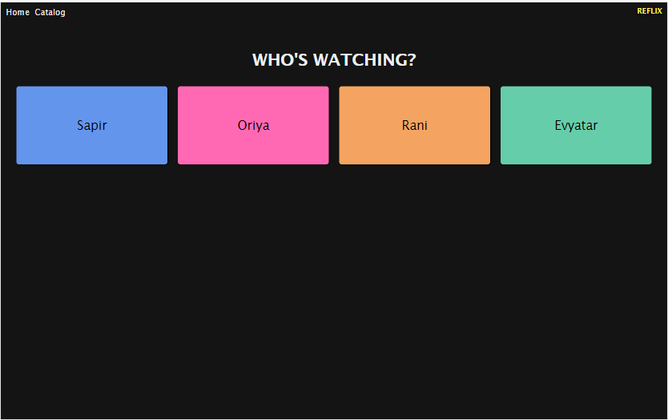
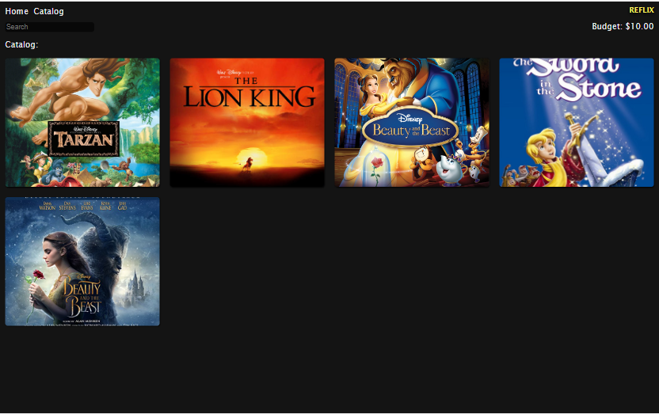

## Overview

Reflix is a movie rental app. It allows a user to browse a catalog of movies, and select some to rent, so long as the user has the budget for it. This is a very special kind of renting system wherein the money is returned to the user when the movie is returned.

## Technologies

Basic React components, using router libary.

## Screenshot

